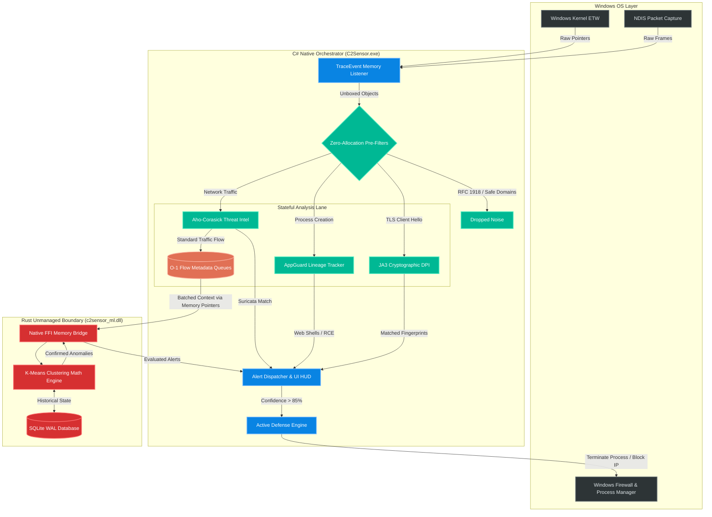

### Logical Layout
---

1. **The Ingestion Lane (ETW to Pre-Filters):** This must be entirely zero-allocation. The C# engine reads raw memory pointers from Windows ETW and immediately discards 95% of traffic (RFC 1918, safe domains, broadcast) before it ever becomes a C# object.
2. **The Stateful Analysis Lane (C# Orchestrator):** Traffic that survives the pre-filters is routed to specialized engines. The Aho-Corasick engine performs O(1) threat intel matching. Flow Metadata is stored in `ConcurrentQueue` structures to prevent heap fragmentation.
3. **The Math & Memory Lane (Rust ML Engine):** This is physically separated into `c2sensor_ml.dll`. Instead of passing slow JSON strings, the C# orchestrator passes native memory pointers across the Foreign Function Interface (FFI) bridge directly into Rust. Rust handles the heavy K-Means clustering and SQLite database writes autonomously, preventing the .NET Garbage Collector from ever seeing that data.
4. **The Execution Lane (Active Defense):** When an anomaly is confirmed by either the C# heuristics or the Rust ML engine, the defense module executes mitigation asynchronously to prevent blocking the main network listener thread.

