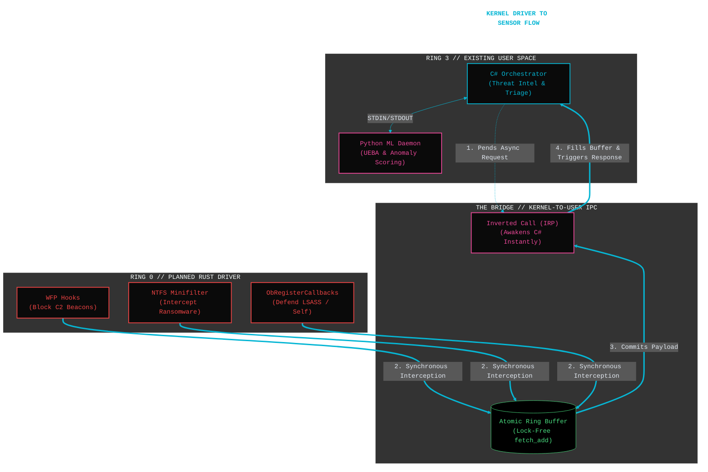

# Deep Sensor V3.0 Development Roadmap (Windows XDR)

**Theme:** Evolution from Reactive Host EDR to Proactive, Enterprise-Grade Windows XDR.

**Core Objective:** Integrate synchronous Ring-0 interception (Rust), advanced in-memory threat hunting, Windows Identity defense, and multi-host telemetry correlation.

## Phase 1: Ring-0 Foundation & Self-Defense (The Rust Integration)
*The goal of this phase is to move from asynchronous observation (ETW) to synchronous, pre-execution interception, while making the Ring-3 sensor highly resilient.*

- [ ] **WFP (Windows Filtering Platform) Integration:** Deploy the Rust driver to hook network socket creation. Monitor outbound connections for C2 beaconing signatures (jitter, malicious ASNs, anomalous TLS handshakes) and drop the packets synchronously.
- [ ] **Kernel-Level Self-Defense (`ObRegisterCallbacks`):** Implement object callbacks in the Rust driver to strip `PROCESS_TERMINATE`, `PROCESS_SUSPEND_RESUME`, and `PROCESS_VM_WRITE` access rights from any non-SYSTEM process attempting to touch `DeepSensor_Launcher.ps1`, `OsAnomalyML.py`, or `lsass.exe`.
- [ ] **Filesystem Minifilter (Ransomware Containment Filter):** Expand the Rust driver to include an NTFS Minifilter. Instead of just logging `FileIOWrite` via ETW, the kernel driver will synchronously block high-speed, high-entropy file modifications to the Master File Table (MFT) or user directories before the disk is written to.
- [ ] **Kernel-to-User IPC:** Establish a secure, high-speed communication channel (e.g., inverted call model or kernel named pipe) to stream network and filesystem telemetry from the Rust driver up to the C# orchestrator.

## Phase 2: Advanced In-Memory Threat Hunting
*The goal of this phase is to catch highly sophisticated APTs and red teams utilizing Sleep Obfuscation (Ekko, Gargoyle, Foliage) and memory encryption.*

- [ ] **Proactive Thread Sweeping:** Upgrade the C# engine from passive event listening to active enumeration. Periodically sweep the OS for threads stuck in `DelayExecution` with anomalous Asynchronous Procedure Call (APC) queues.
- [ ] **Page Permission Tracking:** Monitor specific memory regions for high-frequency permission flipping (e.g., `PAGE_READWRITE` transitioning to `PAGE_EXECUTE_READ` and back). This mathematically flags polymorphic beacons that wake up, decrypt themselves to execute, and re-encrypt before going back to sleep.
- [ ] **ETW-Ti (Threat Intelligence) Integration:** Update the C# engine to consume the `Microsoft-Windows-Threat-Intelligence` provider. This heavily restricted, Microsoft-signed provider offers kernel-verified logs of dynamic code allocation and thread hijacking, bypassing Ring-3 unhooking entirely.

## Phase 3: Identity & Credential Defense (Deep Windows)
*With Linux out of scope, V3 will focus heavily on the primary target of Windows domain breaches: Identity and Token manipulation.*

- [ ] **Token Stealing & Impersonation Detection:** Utilize the Rust driver to monitor for `SeDebugPrivilege` abuse and primary access token modifications, catching attackers attempting to elevate from local Admin to `SYSTEM` via token duplication.
- [ ] **Named Pipe Impersonation Traps:** Deploy decoy Named Pipes (Honey-Pipes) designed to look like vulnerable services. When an attacker connects to attempt a `ImpersonateNamedPipeClient` privilege escalation, the sensor instantly isolates the host.
- [ ] **LSASS Handle Correlation:** Correlate ETW process access requests with the Rust driver's Object Callbacks to definitively block and alert on any non-whitelisted process requesting `PROCESS_VM_READ` to the LSASS memory space.

## Phase 4: The XDR Brain (Cross-Domain ML Correlation)
*The goal of this phase is to upgrade the Python UEBA engine to process and correlate multi-domain telemetry, drastically reducing false positives.*

- [ ] **Multi-Variate Schema Update:** Expand the Python JSON ingestion schema to accept network telemetry and token data (from the Rust driver) alongside the existing OS telemetry (from the C# engine).
- [ ] **Cross-Domain Correlation Engine:** Update the Isolation Forest logic to score chained events across domains. (e.g., *A medium-entropy PowerShell execution is ignored, but a medium-entropy PowerShell execution followed exactly 400ms later by an outbound socket to an unknown IP pushes the anomaly score to 10.0*).
- [ ] **Dynamic Threshold Adjustments:** Allow the ML daemon to dynamically lower its alerting threshold if the host is actively exhibiting early-stage reconnaissance behavior (like `whoami /priv` or excessive `net group` commands).

## Phase 5: Enterprise Consolidation & Scaling
*The goal of this phase is to scale the architecture from a single-host deployment to a fleet-wide Active Directory integrated solution.*

- [ ] **Centralized SQL Migration:** Transition the local SQLite WAL databases to a highly available, centralized SQL Server architecture.
- [ ] **Fleet-Wide Baselining:** Update the UEBA engine to baseline behavior not just against the local host's history, but against the aggregated baseline of the entire enterprise fleet (e.g., *Is this `svchost.exe` child process rare for this specific machine, or rare for the entire accounting subnet?*).
- [ ] **Active Directory Integrated Quarantine:** Upgrade the `Invoke-HostIsolation` routine. Instead of just modifying the local Windows Firewall, the orchestrator can communicate with the Domain Controller to dynamically disable the compromised machine's AD account, instantly severing its Kerberos trust with the rest of the network.