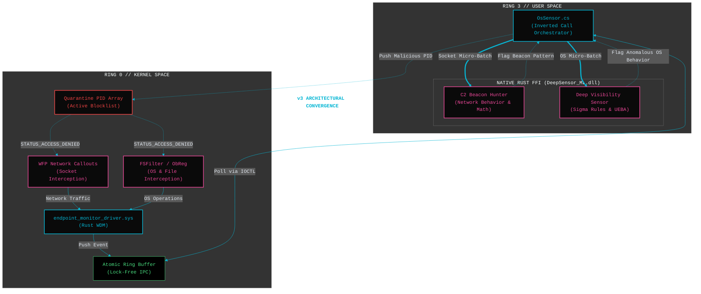
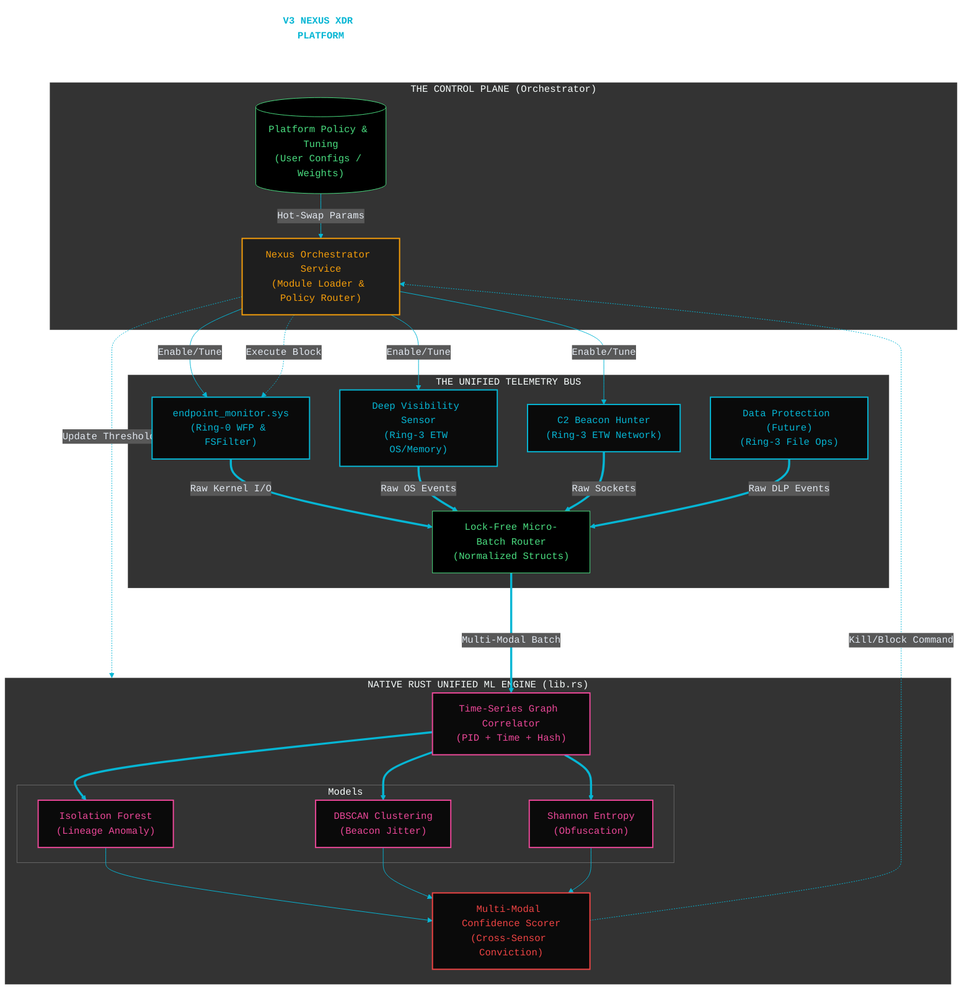

# Deep Sensor -> C2 Beacon Hunter Convergence (v3 Roadmap)

**Theme:** Transitioning from Reactive Ring-3 Observation (ETW) to Proactive Ring-0 Interception (WFP/Minifilter) to support Universal Server-Side Application Defense.

**Core Objective:** Fuse the high-speed Native Rust ML engine with a custom Windows Kernel Driver. By intercepting file I/O and network sockets synchronously at Ring-0, the Isolation Forest can mathematically detect and quarantine C2 beacons before the outbound packet leaves the host.

---

## Phase 1: Deep Visibility v2.1 Stabilization (COMPLETED)
*The foundation is mathematically sound and stripped of interpreted bottlenecks.*
- [x] **Python Deprecation:** Completely removed the Python daemon and STDIN/STDOUT pipe latency.
- [x] **Native FFI Implementation:** Compiled the Isolation Forest and UEBA SQLite engine into a native C-compatible DLL (`lib.rs`).
- [x] **Micro-Batching:** Engineered the C# `BlockingCollection` to feed up to 1,000 events per P/Invoke cross, eliminating thread pool exhaustion.
- [x] **Asynchronous Training:** Implemented `Arc<RwLock>` allowing the Isolation Forest to rebuild in a background thread without pausing ETW ingestion.

## Phase 2: Ring-0 Telemetry Pipeline (Current Sprint)
*Replacing the asynchronous C# ETW listener with synchronous Rust kernel callbacks.*
- [ ] **WDK Compilation Pipeline:** Finalize `build.rs` and `Cargo.toml` configurations for the `wdk-sys` WDM driver model.
- [ ] **Minifilter Registration:** Implement `FLT_OPERATION_REGISTRATION` for `IRP_MJ_CREATE`, `READ`, and `WRITE` to track process and file operations natively.
- [ ] **The Inverted Call Bridge:** Wire the lock-free `AtomicUsize` Ring Buffer (`buffer.rs`) to securely hold kernel events until the C# orchestrator polls them via `DeviceIoControl`.

## Phase 3: C2 Beacon Hunter Integration
*Bringing the specific C2 hunting logic down to the kernel.*
- [ ] **WFP Callout Hooks:** Instrument the Windows Filtering Platform (WFP) to capture outbound IPv4/IPv6 socket creation.
- [ ] **Network Entropy Correlation:** Feed the destination IPs, payload sizes, and connection frequencies into the Ring-3 FFI ML Engine.
- [ ] **Beacon Pattern Recognition:** Configure the Isolation Forest to score rhythmic, low-jitter outbound network calls typical of Cobalt Strike or sliver beacons.

## Phase 4: Synchronous Active Defense
*Executing wire-speed containment without crashing the host.*
- [ ] **Kernel Quarantine Array:** Utilize the `QUARANTINED_PIDS` atomic array in `buffer.rs` to maintain a strict blocklist.
- [ ] **Drop-on-Sight:** When the ML engine flags a PID as a beacon (-1.0 score), C# pushes the PID via IOCTL to the kernel array. The minifilter and WFP hooks instantly `STATUS_ACCESS_DENIED` all further operations for that PID.
- [ ] **Driver Signing & HLK:** Execute `sign_kernel_driver.ps1` using the EV Certificate and submit for WHCP attestation to bypass HVCI restrictions on modern OS builds.

## Platform Development

### The 20k-Foot View: The "Nexus" Architecture

The architecture will have three distinct layers:
1. **The Telemetry Bus**
2. **The Unified ML Brain**
3. **The Control Plane**.

---

### Core Pillar 1: The Unified Native ML Engine (Rust)
Because we have dropped Python, we are no longer bound by IPC bottlenecks. The new `lib.rs` DLL becomes a **multi-modal mathematical engine**.

Instead of routing network data *only* to the C2 logic and OS data *only* to the Isolation Forest, **all telemetry enters a unified Time-Series Graph Correlator**.
* **The Correlation Matrix:** When the engine receives events, it links them by `PID`, `TID`, and `Timestamp`.
* **The Multiplier Effect:** If the DBSCAN clustering algorithm detects a borderline network jitter (e.g., 60% confidence of a C2 beacon), it queries the Isolation Forest: *"Did this PID exhibit anomalous lineage recently?"* If the Isolation Forest confirms that the PID was spawned by `wmiprvse.exe` (lateral movement) 400ms prior, the engine applies a mathematical multiplier, spiking the total confidence to 99.9% and instantly triggering a quarantine.

### Core Pillar 2: The Nexus Orchestrator (The Control Plane)
To manage multiple sensors, the orchestrator (currently the PowerShell/C# hybrid, eventually transitioning to a standalone Rust Service) acts as the **Module Loader**.
* **Dynamic Loading:** Sensors are no longer hardcoded loops. They are classes or native threads. The orchestrator reads a configuration file and spins up the requested sensors (e.g., "Load OS Sensor", "Disable DLP Sensor").
* **Configuration Hot-Swapping:** User parameters (e.g., `EntropyThreshold = 5.5`, `AutoQuarantine = True`, `LearningDays = 14`) are stored in an `Arc<RwLock<Config>>` in the Rust engine. The orchestrator can dynamically overwrite this lock without tearing down the telemetry pipeline, immediately altering the ML engine's sensitivity on the fly.

### Core Pillar 3: Standardized Telemetry Schema
For a single ML engine to correlate data from a Ring-0 driver, a Ring-3 network ETW feed, and an OS behavioral feed, the telemetry schema must be heavily normalized before it crosses the FFI boundary into Rust.
* Instead of custom JSON strings per sensor, all sensors map their findings into a standardized Rust struct (e.g., `PlatformEvent`).
* Every `PlatformEvent` must contain a global `ActorID` (usually the PID/TID combo) and a microsecond-precision timestamp. This allows the Rust correlation graph to weave the disparate events into a single execution storyline seamlessly.

### Core Pillar 4: Centralized Ring-0 Enforcement
In V3, the Ring-0 driver (`endpoint_monitor_driver.sys`) is not just a sensor; it is the ultimate enforcement arm of the platform.
* When the Unified ML Engine reaches a conviction confidence of 100%, it doesn't need to guess how to stop it. It simply returns the `PID` to the Orchestrator with an `ACTION_KILL` flag.
* The Orchestrator pushes that PID directly into the Ring-0 `QUARANTINED_PIDS` atomic array. The driver immediately slices all outbound network sockets (WFP) and blocks all disk I/O (FSFilter) for that process simultaneously.

### The Developmental Path Forward
To bridge the gap from the current V2.1 architecture to this V3 Platform, the next logical step is to build the **Unified Config Struct** and the **Time-Series Graph Correlator** in the Rust DLL. This prepares the mathematical brain to accept and correlate the C2 network batches alongside the OS batches.

## High Level Phases

**V3 Ascendancy Roadmap**

* **Phase 1: Foundation Soak (Current)** -> Monitor V2.1 (Native FFI OS Sensor) for absolute stability, memory safety, and ETW drop-rates under extreme stress.
* **Phase 2: Protection Standardization** -> Optimize, standardize, and harden the Active Defense (Suspend/Dump/Strip) containment cycle to ensure it triggers flawlessly without destabilizing the host.
* **Phase 3: Sensor Fusion** -> Absorb the C2 Beacon Hunter. Wire the Ring-3 network ETW telemetry into `OsSensor.cs` and merge the DBSCAN clustering logic into the native `lib.rs` DLL.
* **Phase 4: Unified ML Correlation** -> Link the OS and Network feeds into a single Time-Series Graph Correlator within Rust to achieve cross-modal conviction (Testing & Validation).
* **Phase 5: Ring-0 Vanguard** -> Inject the `endpoint_monitor_driver.sys` kernel driver. Transition from reactive Ring-3 ETW observation to synchronous Ring-0 WFP/FSFilter interception.
* **Phase 6: The Nexus Platform (V3)** -> Finalize the Orchestrator Control Plane, linking the Ring-0 telemetry/containment pipeline directly into the Unified ML Engine for true XDR capabilities.
